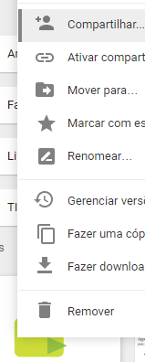

# GoogleDriveVideo2HTML
---
Use Google Drive Videos with custom HTML players 

### How to use
Build the software, execute the program passing the Google Drive Sharing link as argument, to generate **JSON** you can pass a third argument as true (or really anything), the output will be Google Drive direct link to the video file, be aware that the link will expire after some time.

To use on your HTML5 you just grab one of the links from the program and put on a HTML5 video tag.

#### Problems
Make sure to use the Google Drive Sharing link, sometimes (not the download link).
Check your sharing options as well.
